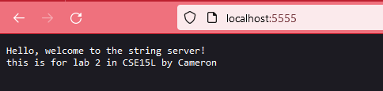
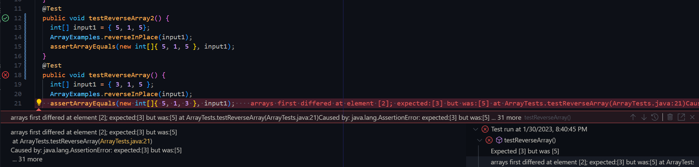

# Lab Report 2 - Servers and Bugs 
## Cameron Bishop
---
The first task of this lab report was creating a simple server that can add to a string with a certain URI query. My version of this server I coded looked like this in VSCode.  


  
---
Then, once the server was running on my local machine, I added to the empty serverMessage string what was past the <code>=</code> sign in a url, formatted like: <code>/add-message?s=Hello, welcome to the string server!</code> where the string is after the <code>s=</code>.  

The methods called by my code are two functions in the java URI class, getQuery and getPath, and 3 string methods, split, equals, and concat.   

the relevant arguments to the methods are what is given by the path in the url, the <code>"add-message"</code>, <code>"s=</code>, this is what allows the code to know that a string is going to be given to be added in the URL. Then the string that is to be added to the <code>serverMessage</code> string is relevant to the <code>concat</code> method call.  

The only real value that is changed from all of these function calls is the <code>serverMessage</code> string thats displayed when you visit the servers root. 


---
Then I did this once again with a second string

The methods called by my code are once again the same functions in the java URI class, getQuery and getPath, and 3 string methods, split, equals, and concat.

the relevant arguments to the methods are what is given by the path in the url, the <code>"add-message"</code>, <code>"s=</code>, this is what allows the code to know that a string is going to be given to be added in the URL. Then the string that is to be added to the <code>serverMessage</code> string is relevant to the <code>concat</code> method call. In this url, it is a different string to be added <code>this is for lab 2 in CSE15L by Cameron</code> 


---

Then, to see the overall string serverMessage that these queries modified, you visit the basic localhost with the path as backslash. that will look like this:    



---
A failure inducing input for the function I chose <code>reverseInPlace(int[] array)</code> , is any array that is not naturally mirrored in the center. This would fail because the second half would be overwritten, and it the actual would be <code>new int[]{ 5, 1, 5 }</code>  

```
@Test 
	public void testReverseArray() {
    int[] input1 = { 3, 1, 5 };
    ArrayExamples.reverseInPlace(input1);
    assertArrayEquals(new int[]{ 5, 1, 3 }, input1);
	}
```
An input that does not induce a failure is something that is an array this is mirrored across the center. This is because it is okay that it overwrites when it goes over the whole array because it is still the correct values.  

```
@Test 
	public void testReverseArray2() {
    int[] input1 = { 5, 1, 5 };
    ArrayExamples.reverseInPlace(input1);
    assertArrayEquals(new int[]{ 5, 1, 5 }, input1);
	}
```
Running these two JUnit Tests gives this output (flipped order so that the error doesnt cover up the second test) :  



Then, me and my partner in lab solved this bug in the <code>reverseInPlace(int[] array)</code> function where the error had to do with how it would both iterate over the whole arraylist and end up mirroring the array in the middle, and not using a temporary variable to store the value that is taken from the array so it cannot be overwritten. before the fix it looked like this:  

```
 static void reverseInPlace(int[] arr) {
    for(int i = 0; i < arr.length; i += 1) {
      arr[i] = arr[arr.length - i - 1];
    }
  }
```
  
After me and my partner's changes, it looked like this:  
```
static void reverseInPlace(int[] arr) {
    for(int i = 0; i < (arr.length / 2); i += 1) {
      int temp = arr[i];
      arr[i] = arr[arr.length - i - 1];
      arr[arr.length - i - 1] = temp;
    }
  }
```
---


