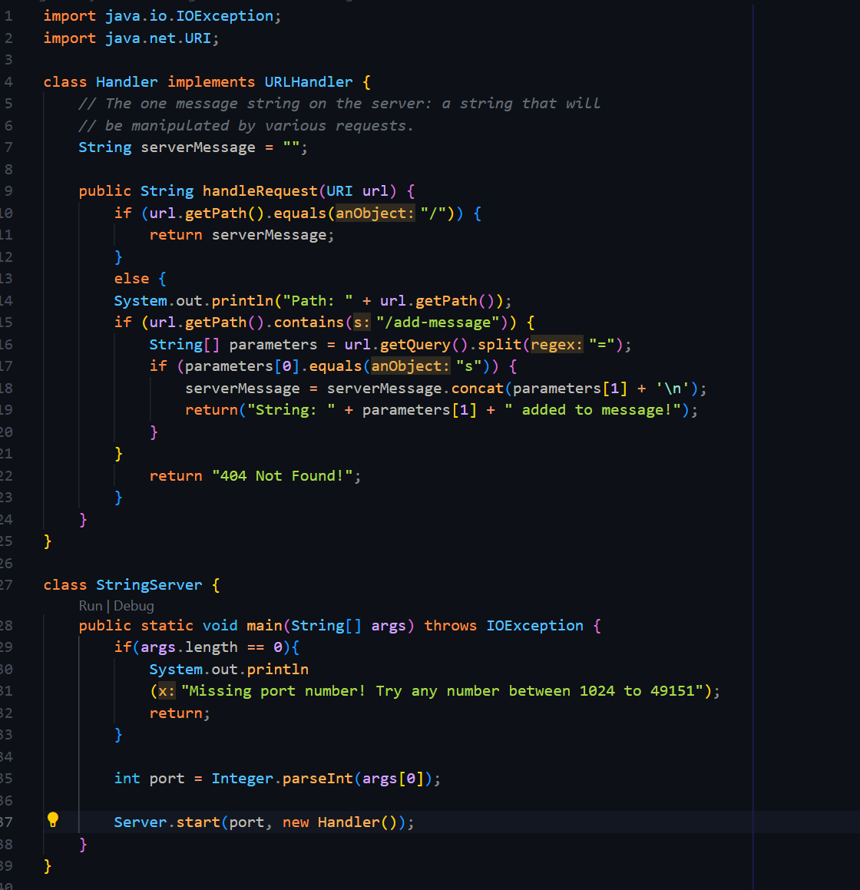

# Lab Report 2 - Servers and Bugs 
## Cameron Bishop
---
The first task of this lab report was creating a simple server that can add to a string with a certain URI query. My version of this server I coded looked like this in VSCode.  

  
---
Then, once the server was running on my local machine, I added to the empty serverMessage string what was past the <code>=</code> sign in a url, formatted like: <code>/add-message?s=Hello, welcome to the string server!</code> where the string is after the <code>s=</code>.  

