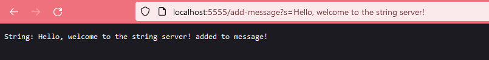
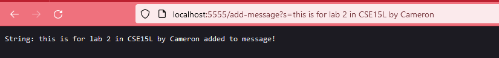

# Lab Report 2 - Servers and Bugs 
## Cameron Bishop
---
The first task of this lab report was creating a simple server that can add to a string with a certain URI query. My version of this server I coded looked like this in VSCode.  

  
---
Then, once the server was running on my local machine, I added to the empty serverMessage string what was past the <code>=</code> sign in a url, formatted like: <code>/add-message?s=Hello, welcome to the string server!</code> where the string is after the <code>s=</code>.  

The methods called by my code are two functions in the java URI class, getQuery and getPath, and 3 string methods, split, equals, and concat.   

the relevant arguments to the methods are what is given by the path in the url, the <code>"add-message"</code>, <code>"s=</code>, this is what allows the code to know that a string is going to be given to be added in the URL. Then the string that is to be added to the <code>serverMessage</code> string is relevant to the <code>concat</code> method call.  

The only real value that is changed from all of these function calls is the <code>serverMessage</code> string thats displayed when you visit the servers root. 

---
Then I did this once again with a second string

The methods called by my code are once again the same functions in the java URI class, getQuery and getPath, and 3 string methods, split, equals, and concat.

the relevant arguments to the methods are what is given by the path in the url, the <code>"add-message"</code>, <code>"s=</code>, this is what allows the code to know that a string is going to be given to be added in the URL. Then the string that is to be added to the <code>serverMessage</code> string is relevant to the <code>concat</code> method call. In this url, it is a different string to be added <code>this is for lab 2 in CSE15L by Cameron</code> 

---

